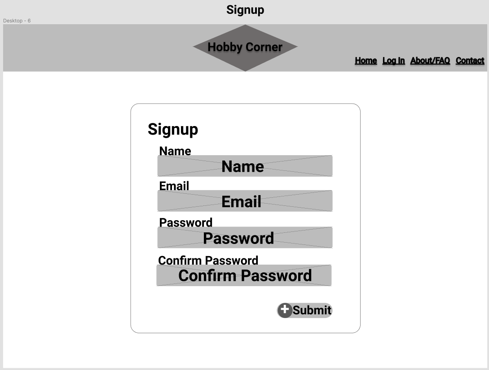

# Hobbyist Corner

# ToDo

## About Hobbyist Corner

Users can come together and share their hobbies in a social platform that showcases their builds and allows other hobbyists to comment on

#### Who is HobbyistCorner for?

Hobbyist in any area of the creative process from adobe to zebra spotting

## User Stories

#### Non-logged-in

- The user will be able to view the homepage, the signup page, the login page, the about page, the FAQ page, and the contact page
- The user will be able to sign up on the sign up page.
- The user will be able to log in if they have created an account.

#### Logged-in

- The user will be able to view all of the pages above
- The user, after logging in will be taken to their profile page where they can veiw all of their posts and the posts of the hobbyist they are following.
- From here, the user can go to:
  - create a post
    - the create a post page will allow the user to add projects to their page
  - update a post
    - add an update to the project
      - upload a photo for their project
      - update description of work done that post
    - change previous posts in the project page
    - delete previous posts in project
  - view a friends page
    - view their projects page
      - add comments to project and project updates
      - give kuddos in the form of a favicon
  - go to the profile settings page
    - update the user's hobbys
    - change the color theme (extras)
    - delete profile

## Planing Wireframe

## Planned Database
